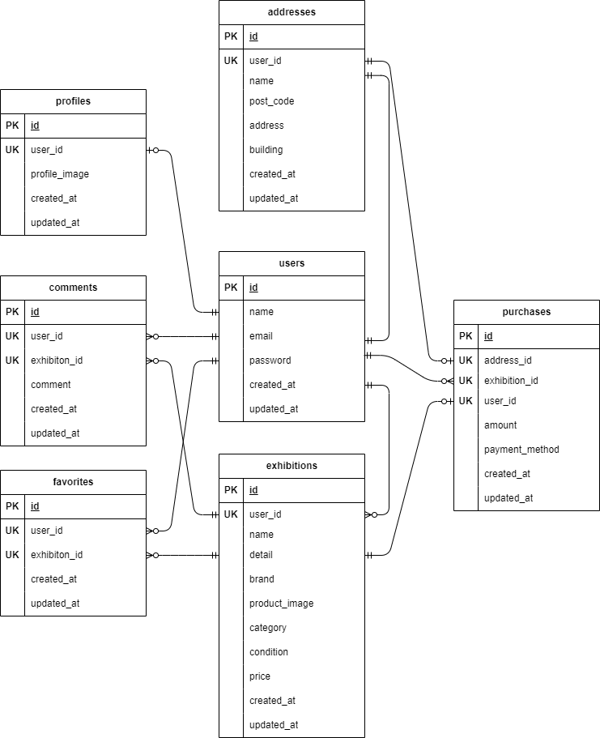

# Free Market
## 環境構築
**Dockerビルド**
1. `git clone git@github.com:kameda11/free-market3.git`
2. DockerDesktopアプリを立ち上げる
3. `docker-compose up -d --build`


**Laravel環境構築**
1. `docker-compose exec php bash`

2. `composer install`

3. 「.env.example」ファイルを 「.env」ファイルに命名を変更。または、新しく.envファイルを作成

4. .envのメール設定を変更する
###メール設定</br>
・Mailtrapの認証情報を設定してください</br>
・https://mailtrap.io でアカウントを作成し、認証情報を取得できます</br>
``` text
MAIL_MAILER=smtp
MAIL_HOST=sandbox.smtp.mailtrap.io
MAIL_PORT=2525
MAIL_USERNAME=your_mailtrap_username
MAIL_PASSWORD=your_mailtrap_password
MAIL_ENCRYPTION=tls
MAIL_FROM_ADDRESS="your-email@example.com"
MAIL_FROM_NAME="${APP_NAME}"
```
5. アプリケーションキーの作成
``` bash
php artisan key:generate
```

6. マイグレーションの実行
``` bash
php artisan migrate
```

7. シーディングの実行
``` bash
php artisan db:seed
```

## 使用技術(実行環境)
・PHP 7.4.9  </br>
・Laravel 8.83.29 </br>
・MySQL 15.1 </br>

## ER図


## URL
- 開発環境：http://localhost/
- phpMyAdmin:：http://localhost:8080/
