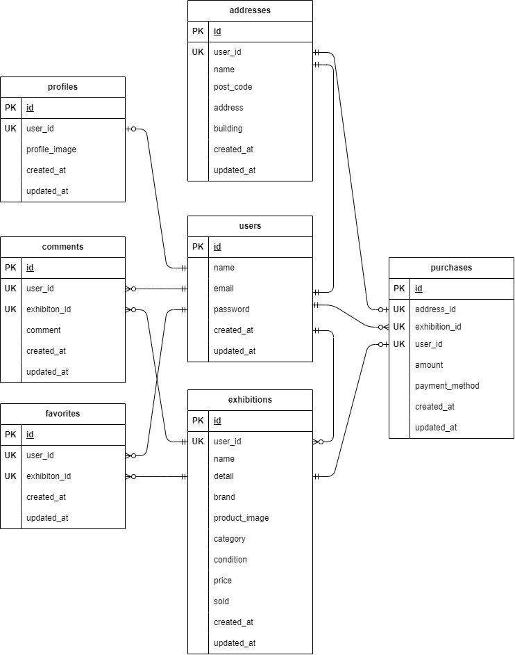

# Free Market

フリーマーケットのWebアプリケーションです。

## 機能

- ユーザー認証（登録・ログイン）
- 商品の出品・購入
- 商品検索
- お気に入り登録
- プロフィール管理
- コメント機能

## 環境構築
**Dockerビルド**
1. `git clone git@github.com:kameda11/free-market2.git`
2. DockerDesktopアプリを立ち上げる
3. `docker-compose up -d --build`

＊　MySQLは、OSによって起動しない場合があるのでそれぞれのPCに合わせて docker-compose.yml ファイルを編集してください。
``` bash

**Laravel環境構築**
1. `docker-compose exec php bash`
2. `composer install`
3. 「.env.example」ファイルを 「.env」ファイルに命名を変更。または、新しく.envファイルを作成
4. .envに以下の環境変数を追加
``` text
DB_CONNECTION=mysql
DB_HOST=mysql
DB_PORT=3306
DB_DATABASE=laravel_db
DB_USERNAME=laravel_user
DB_PASSWORD=laravel_pass

MAIL_MAILER=smtp
MAIL_HOST=sandbox.smtp.mailtrap.io
MAIL_PORT=2525
MAIL_USERNAME=017df9c70d22f5
MAIL_PASSWORD=4197feb209405f
MAIL_ENCRYPTION=tls
MAIL_FROM_ADDRESS="hello@example.com"
MAIL_FROM_NAME="${APP_NAME}"
```
5. アプリケーションキーの作成
``` bash
php artisan key:generate
```

6. マイグレーションの実行
``` bash
php artisan migrate
```

7. シーディングの実行
``` bash
php artisan db:seed
```

## 使用技術(実行環境)
・PHP 7.4.9 </br>
・Laravel 8.83.29 </br>
・MySQL 15.1 </br>

## ER図


## URL
- 開発環境：http://localhost/
- phpMyAdmin:：http://localhost:8080/
